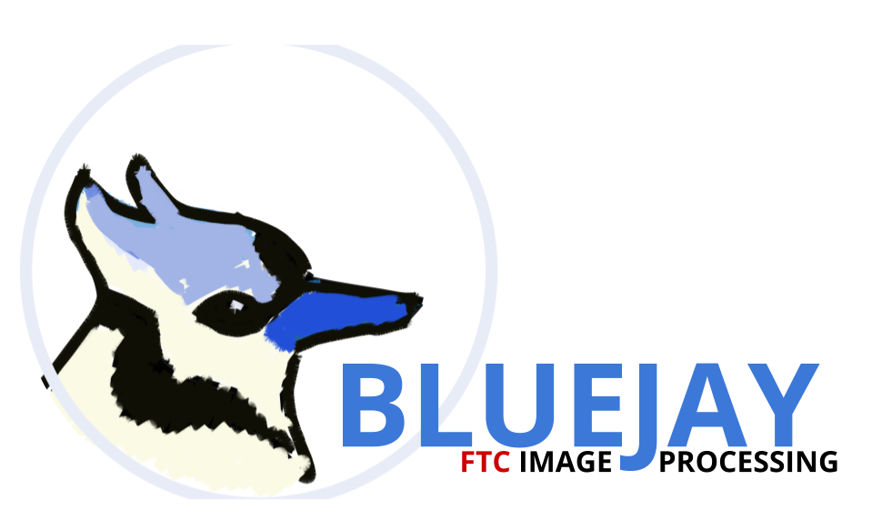
# FTC Team #14473 Future - Image processing Framework

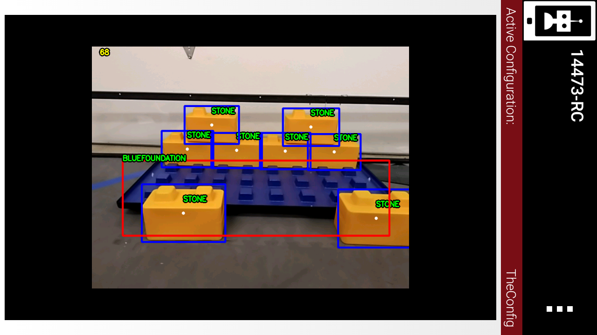
	
This library was made to simplify the agony in doing FTC computer vision in Java.   
It follows a very simple rule:

- If you don't need it, you should never see it. All the boilerpalce nitty gritty is handled by magick.
- That being said, each additional layer of code you peel back should ONLY contain stuff with the same degree of complexity.

## Features

- **Opencv SkyStone Detection** (Bestest one)
- **Opencv Stone Detection** (Pretty good 90%) <- with support for a row of stones touching
- **OpenCV Foundation Detection**
- Simplified interface for Vuforia and tensorflow

## Maximizing Accuracy
- Angle the phone so that the field covers as much of the camera image as possible (best performance: elements completey inside field)
- Don't let stones overlap vertically. The stone detector is optimized for horozontal rows of stones.
- Don't let elements get too far away. Small shapes will be classified as noise
- Don't tilt the camera (like when you steer the car in asphalt 8). The shape classifier will get confused.

## Setup
1. Clone and make a new project at new>project>from version control>git in Android Studio. Code is in the `Teamcode` folder and `bluejay` module. We might do bintray hosting but haven't had time yet :p
2. Sync Gradle. Search for this command with ctrl+shift+a.
3. Go to https://github.com/OpenFTC/OpenCV-Repackaged/tree/master/doc and download the file libOpenCVNative.so. Put this in your phone's storage in the "First" Folder. Depending on your device, the exact location will be different. Look along the lines of "internal" and "storage"
4. Examples are in the `teamcode` folder.

## Using the Library
I've been lax on documentation, so ask if there is ambiguity
First off, working code for everyone:

	*Stuff here is outdated, bleh. Check teamcode for example code which should have been here.	
	

## Contact
If you got questions, email me at <xchenbox@gmail.com> or alternatively, find us on Facebook <https://www.facebook.com/future14473>
We don't have a discord (yet). If there's any problems or ambiguity, shoot me an email

## Gallery

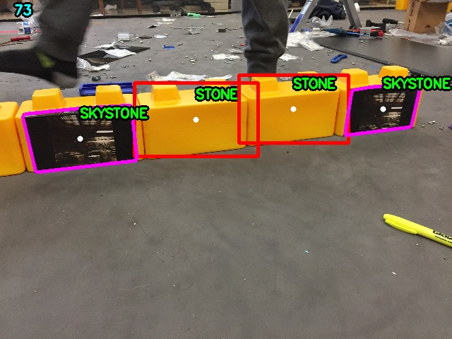
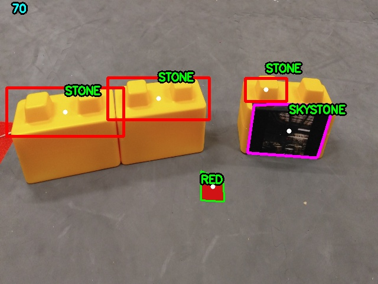
^In this sample, the angle of the camera was too high, so the contrast was auto-adjusted by Android. This makes the side of the stone (what you want to see) darker and not included in the bounding rect.
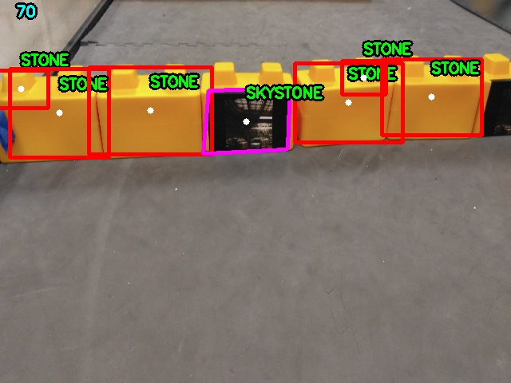
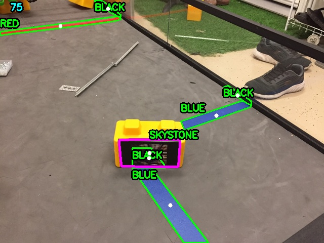
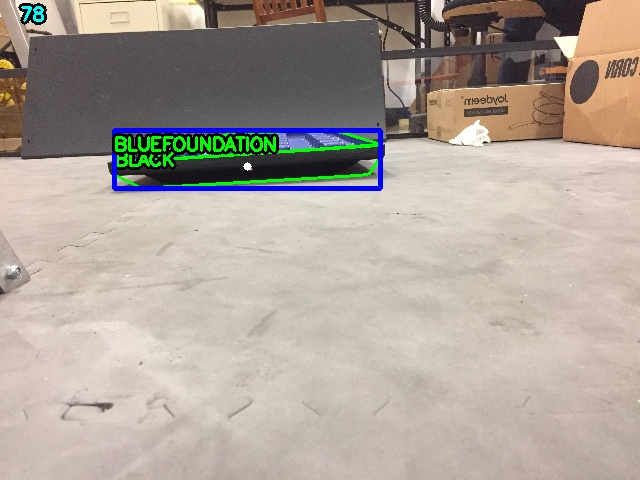
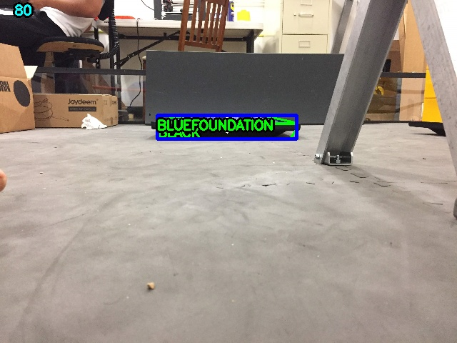
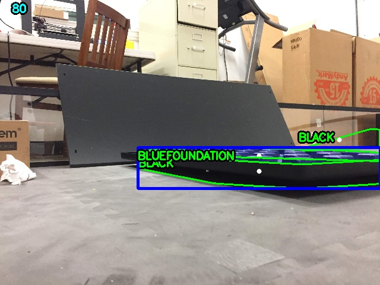
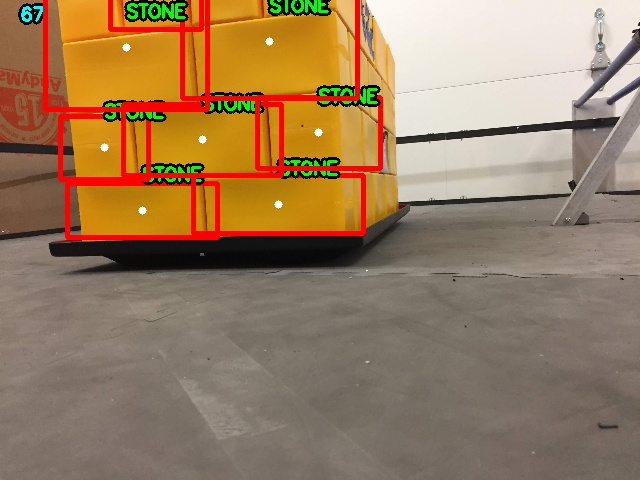
^The thresholder actually separated each stone in this one! However, teeny tiny connections between each blob kept them from being identified separately.
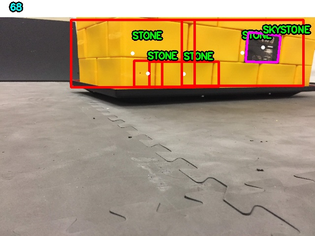
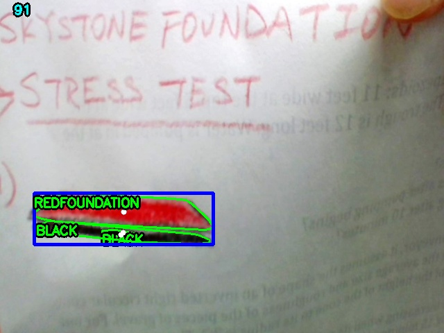
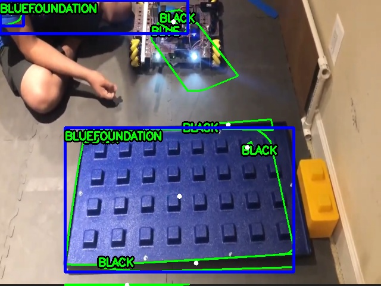
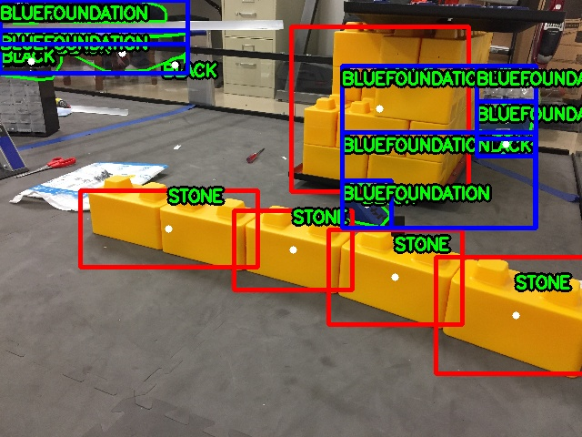
^Which just goes to show that the foundation detector hates seeing outside the field. If you need to scan for foundations and don't want to readjust your mount, just partially cover your camera with tape like we did.
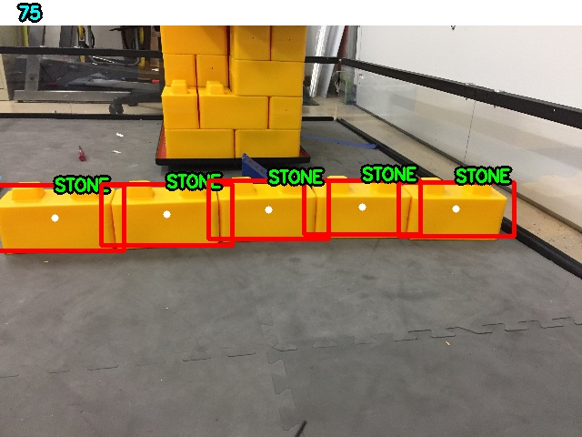
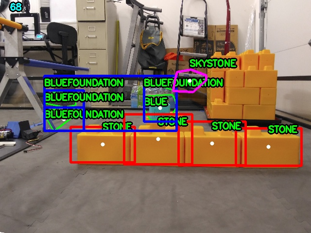
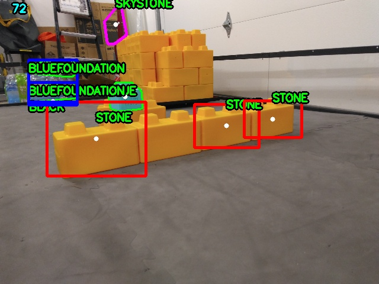
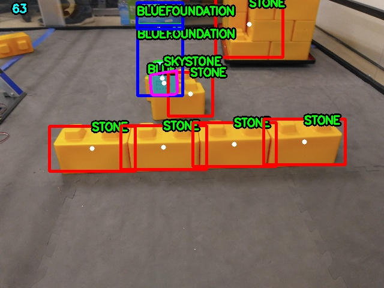
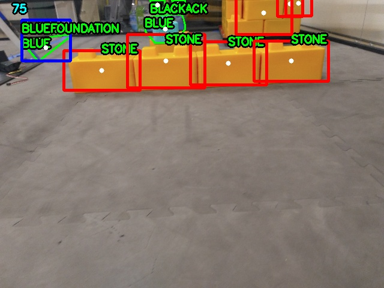
